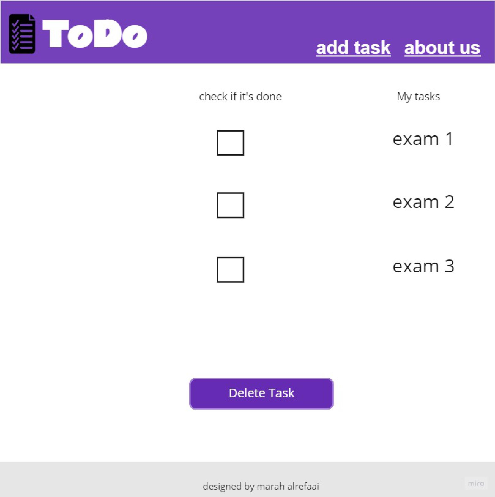
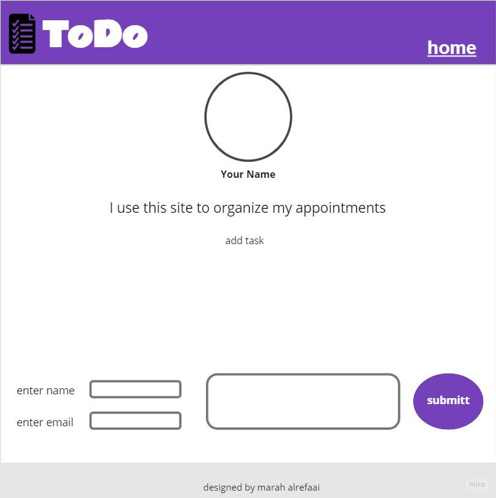

# ToDo
#### ToDo List Website, where the Users can display their tasks and check the status for each one.

## this is design for ToDo list 
#####  first page

  
#####  second page

### Task 4
##### What observations or questions do you have about what you’ve learned so far? i have no questions

##### How long did it take you to complete this assignment? And, before you started, how long did you think it would take you to complete this assignment?  i tooke 3 hours to do it, but i thought that i will take less time like 2 hours ,but i have to read more to solve it 
 
 ### Task 5
##### What observations or questions do you have about what you’ve learned so far? i have no questions

##### How long did it take you to complete this assignment? And, before you started, how long did you think it would take you to complete this assignment?  i tooke 1 hour to do it, but i thought that i will take less time like 30 minutes  ,but i have to read more to solve it  

### Task 6
##### What observations or questions do you have about what you’ve learned so far? i have no questions

##### How long did it take you to complete this assignment? And, before you started, how long did you think it would take you to complete this assignment?  i tooke 30 minutes to do it, but i thought that i will take less time like 15 minutes  ,but i have to read more to solve it  
#### the end of the page 
#### bye
